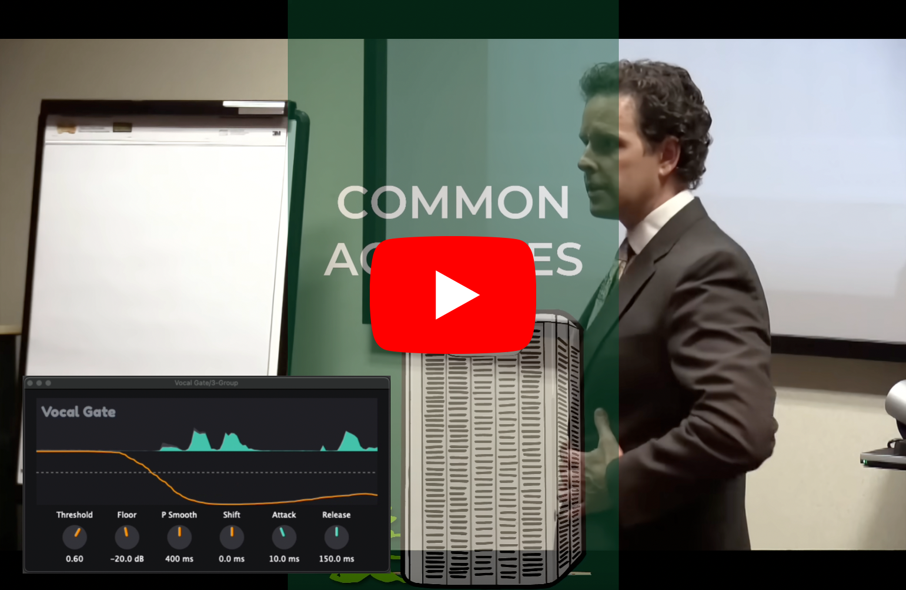
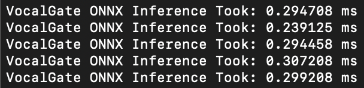
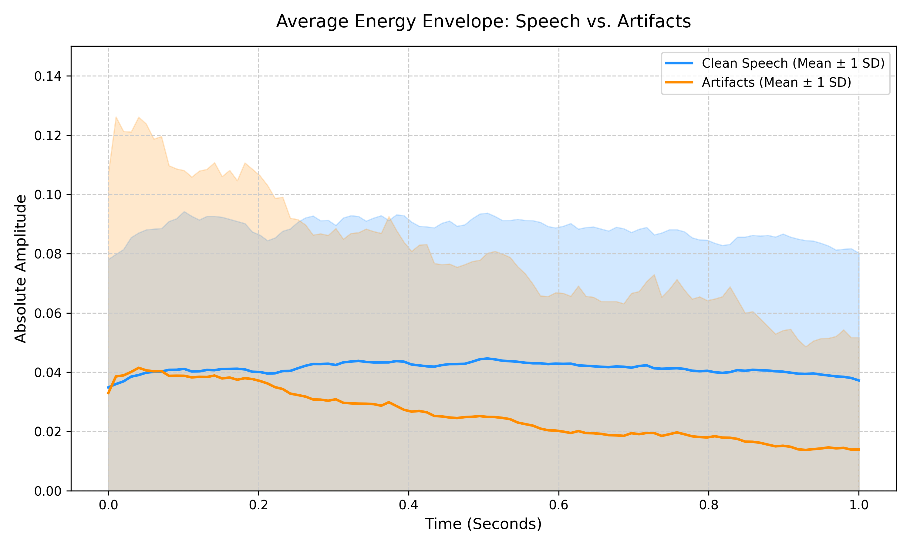
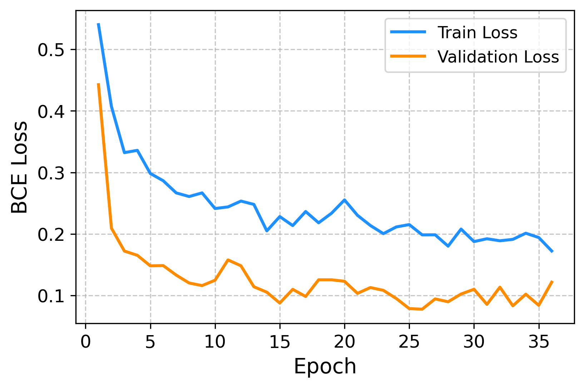
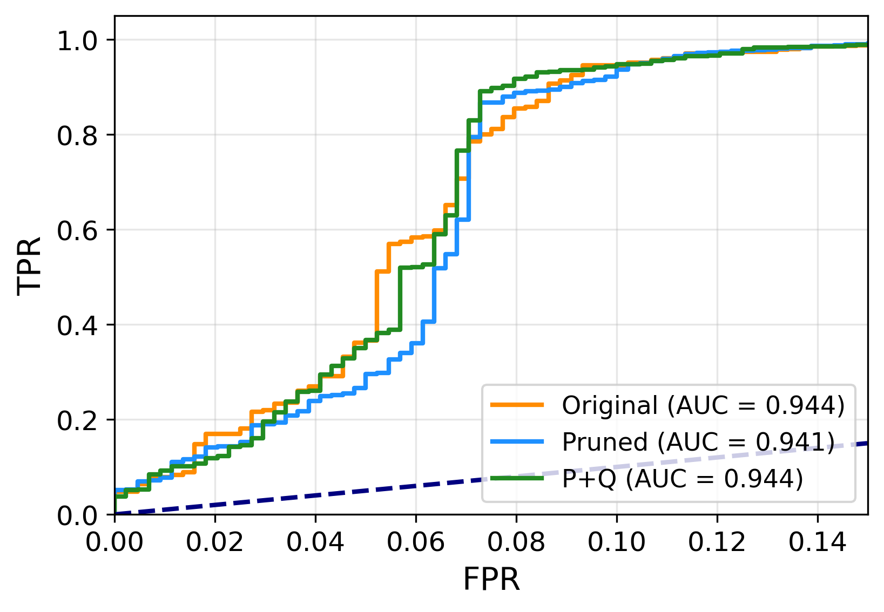

## Vocal Gate VST3/AU/Standalone

An AI-powered noise gate plugin specifically trained to separate clean speech from artifacts and background noise. 

This plugin is intended for Creators and Editors (Podcast, Youtube, etc.) who need a quick and accurate filter. 

  

  
  &nbsp;&nbsp;&nbsp;
  

  <small><b>Requires:</b> macOS 11+ (M-series) &nbsp;|&nbsp; Windows 10+ (64-bit)</small> 
  <i><a href="https://github.com/dan-k-k/vocal-gate/releases/">Release notes</a></i>

*Note: This installer is unsigned*. On macOS, right-click open the installer in your downloads. On Windows, press 'More info' and 'Run anyway'.

### Real-World Use Examples

  

<i>Watch the full demo on YouTube</i>

---

## Model Performance

The plugin relies on a pruned and quantised int8 ONNX model to achieve real-time inference with incredibly low latency (~0.2 - 0.3 ms per buffer). The plugin reports 750ms of latency to build the spectrogram for inference. 

  

### Dataset Energies

  

### Training Loss 

  

### ROC 
The pruned and quantised model has better performance in both inference time and ability on the test set (generalisation).

  

